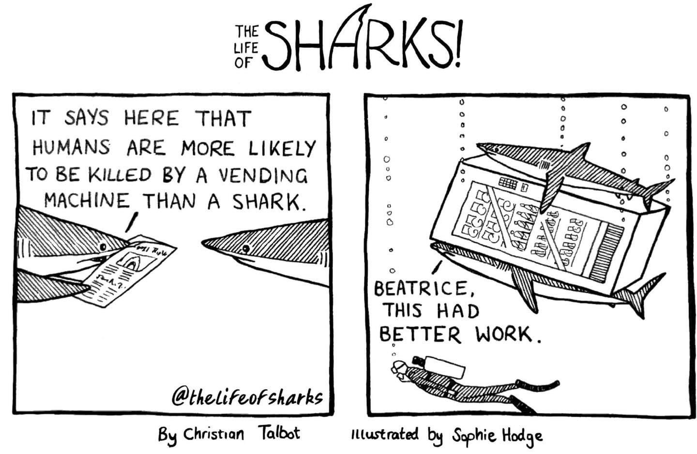
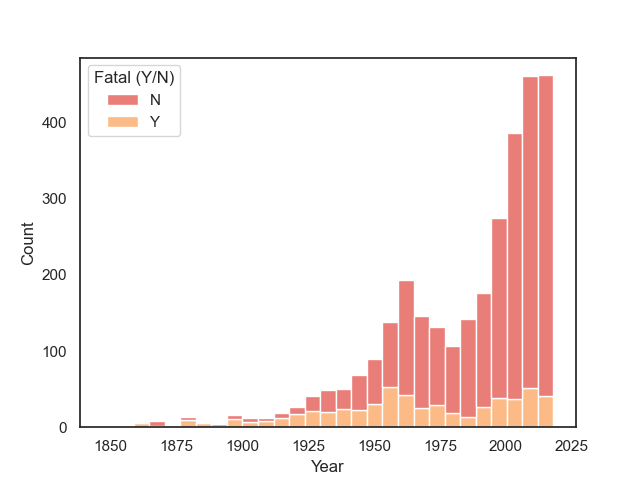
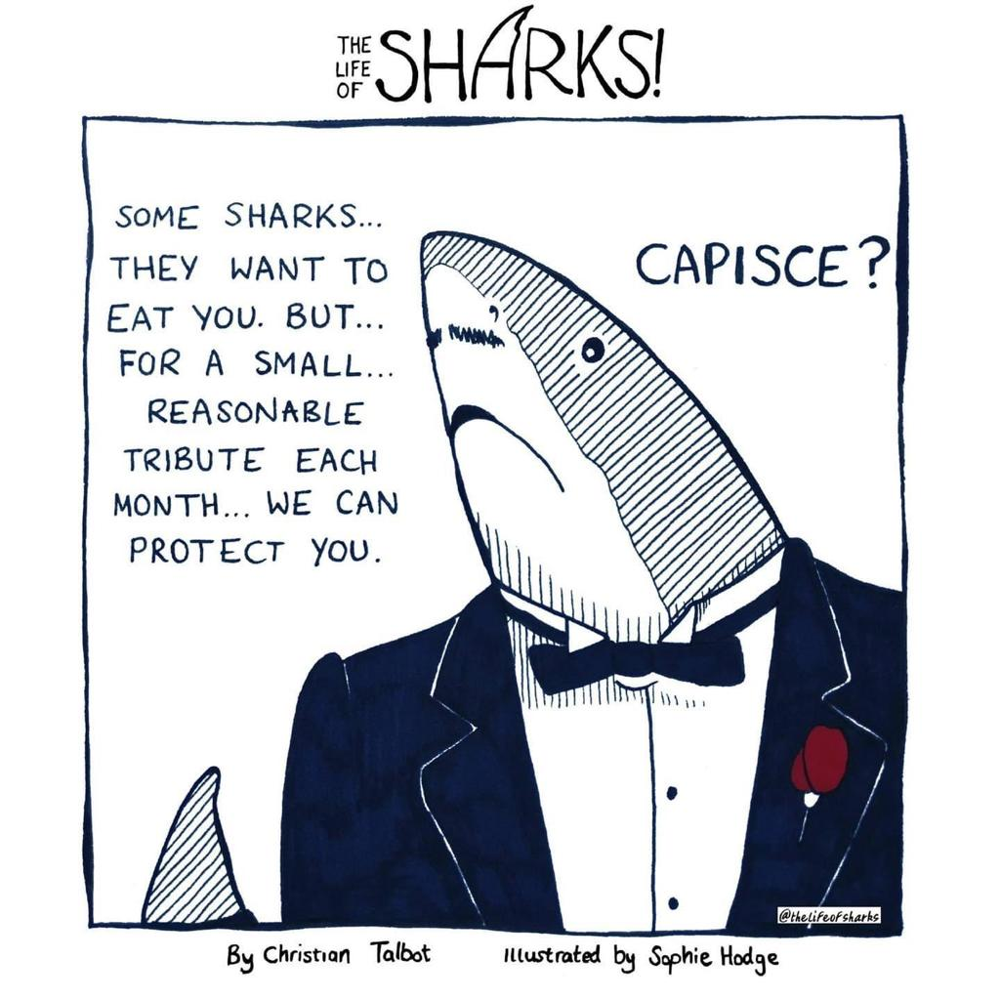
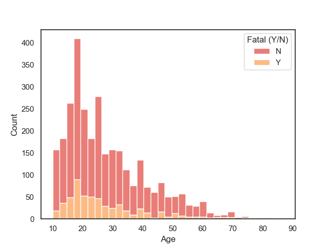
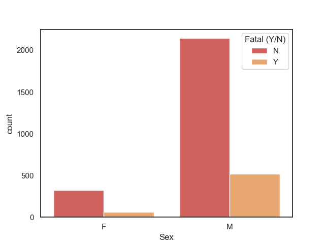
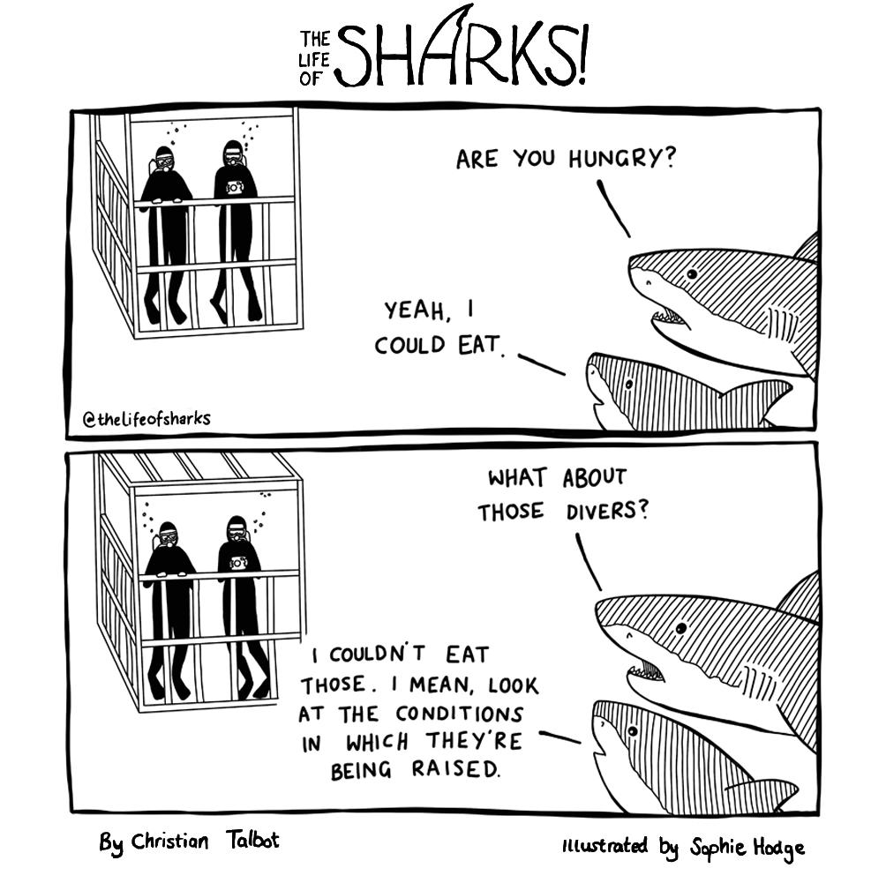
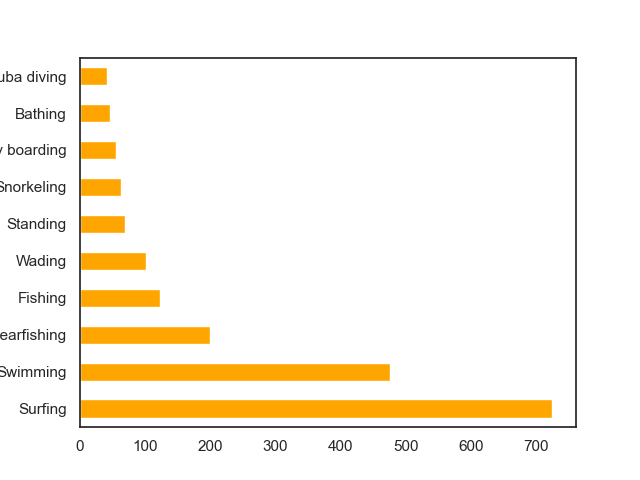
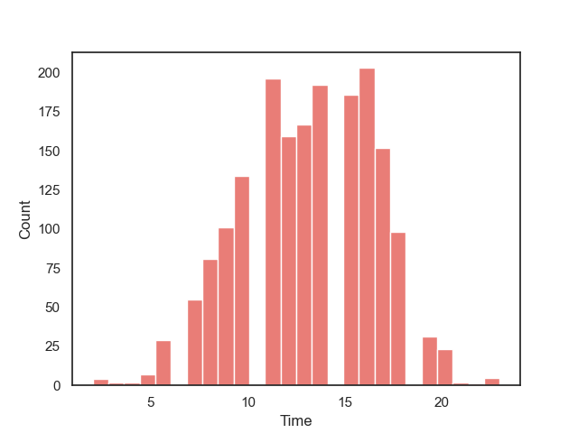
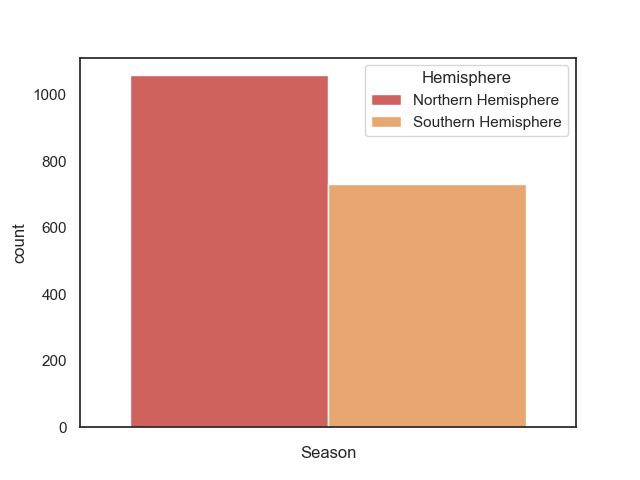

  <h3 align="center">Proving Steven Spielberg's Oscar winning movie wrong: an analysis on shark attacks around the world </h3>

  <h6 align="center">
    Ironhack: project I

## Table of contents

- [Introduction](#introduction)
- [Data Cleaning](#data-cleaning)
- [Who's more likely to be attacked by a shark?](#exploratory-data-analysis)
    * [Year](#11-years)
    * [Age](#12-age)
    * [Sex](#13-sex)
    * [Country](#14-countries)
    * [Activity](#15-activity)
- [Hypothesis one](#hypothesis-one-shark-attacks-are-more-likely-to-happen-in-the-afternoon)
- [Hypothesis two](#hypothesis-two-shark-attacks-are-more-likely-to-happen-in-the-summer)
- [Last remarks](#last-remarks)
- [Thanks](#thanks)
- [References](#references)

## Introduction

Jaws made it pretty clear that sharks are human-killing machines and we should be absolutely terrified of them. Is  that right? Are sharks as deadly as we think they are? Let's see what the data says.

For the number of activities that take place in the ocean, shark attacks are not common at all. The data obtained from the **Global Shark Attack File** has a record of 25 thousand attacks for the last centuries, and although it sounds like a big number, when we consider the amount of people that go into the ocean every year, it doesn't seem like a lot. And although the probability of you being attacked by a shark is pretty low, is still interesting to see the place and the conditions in which this kind of encounters take place more often. You could also run into Beatrice and her pals, so maybe this analysis helps you keep an eye out :wink:  

Also, I think it is important to say that according to the scientists from the Marine Journal: *11,416 sharks are killed worldwide every hour, that’s around 3 sharks per second.* So maybe instead of being terrified by sharks, we should try to stop hunting them. 

## Data Cleaning

First I downloaded the dataframe and cleaned it. The data had more than 25 thousand rows and 24 columns, but around 79% of the data was missing. So I got rid of more than 20 thousand rows and more than 10 columns which didn't add anything to my analysis. I also extracted the month from the Date column, and got rid of the day, and changed the name of some columns, to make data manipulation easier later on.

## Exploratory Data Analysis 

Even though it is not probable to be attacked by a shark. Still, shark attacks do occur sometimes, so let's look into them. **Who is more prone to be attacked by a shark?** 

#### 1.1 Years

As we can see in the following graph, attacks have been increasing in the last 60 years, this may be due to the increase of ocean related activities in the last decades, (or maybe sharks have had technological improvements that help them be better at hunting?)

Still, even though there have been more attacks, the probablity of dying from one of these, has been lower each year. Even if there are more attacks nowadays, the number of fatal victims has stayed the same. 

#### 1.2 Age

By exploring the age of the victims, it's easy to see that the youth is more affected by shark attacks, probably due to the presence of this age range in the ocean, or maybe the elderly have more savings to bribe the ocean mafia. 

As we can see in the next graph, people aged 18-20, are the most attacked by sharks. 

#### 1.3 Sex

If we look into the attacks by sex we can see that men are more likely to be attacked by a shark, and consequently also more likely to die from a shark attack. 

#### 1.4 Countries

If you don't like thrilling, pulse-raising or breath-taking adventures, these are the places to avoid. If you are the opposite, these are the places to go. The 10 countries with most shark attacks are shown in the next table, and as wee can see, the US, Australia and South Africa are top 3. 

#### 1.5 Activity

According to the data, the activity with more recorded attacks is surfing. Experts say that it is because sharks confuse the tables of the surfers with seals, and try to hunt them. Maybe that's the reason why divers are not so attacked by sharks, that or that sharks care about raising conditions and feel bad for them.    

To take a little perspective, there are about 30 million scuba dives around the world each week, that's 1.560 billion dives a year. According to the data, there have only been 127 shark attacks towards divers in the last 222 years that I took into consideration. So attacks are really not common at all. 

## Hypothesis one: shark attacks are more likely to happen in the afternoon

My first hypothesis was to test if there's more attacks in the afternoon, than in the morning. As the next graph shows, my hypothesis wasn't right, since attacks are mostly evenly distributed between morning and afternoon, with a peek at 6 pm, and with a great number of attacks between 11 am - 6 pm. 

## Hypothesis two: shark attacks are more likely to happen in the summer

For this hypothesis, I divided the countries in northern hemisphere and southern hemisphere, since the summer season takes place in different months. After doing this I show in the next graph, the number of attacks per season and per hemisphere, to show that indeed attacks are more likely to occur on the summer in any of the hemispheres. 

Maybe next time you go into the water copy this seal's advice, and you would be good to go : ) 

## Last Remarks

I read that the people that work at the Global Shark Attack File are trying to make data on shark attacks accessible to people so we can see the real threat that sharks have on humans and how to avoid this type of encounters. It's not their purpose to increase people's fear of sharks, they are trying to lessen the likelihood of these incidents via information, and they're trying to defend sharks in a way. So that's what I tried to do as well. This type of accidents happen, but they're not common, and there are things we can avoid to reduce them. 

### Thanks

Special thanks to The Life of Sharks for their ilustrations, and for the work they do in shark conservation. 

Enjoy :shark:

### References

https://www.sciencedirect.com/science/article/abs/pii/S0308597X13000055 