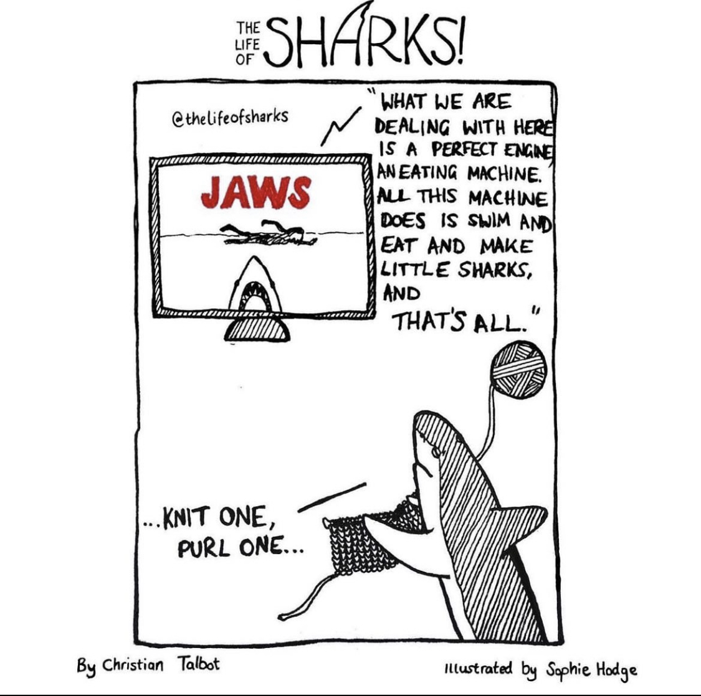
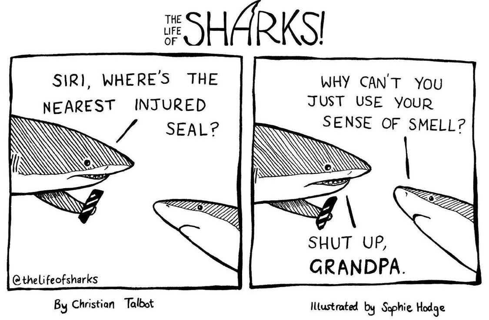
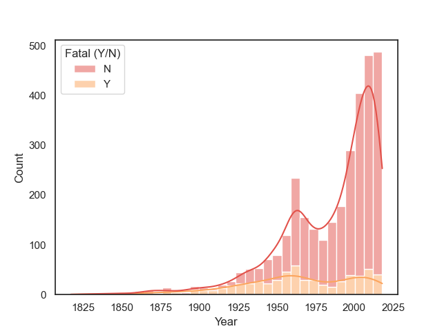
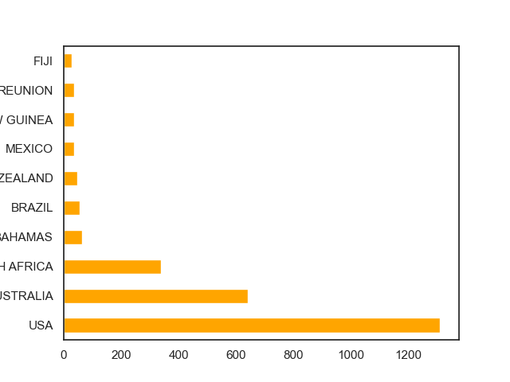
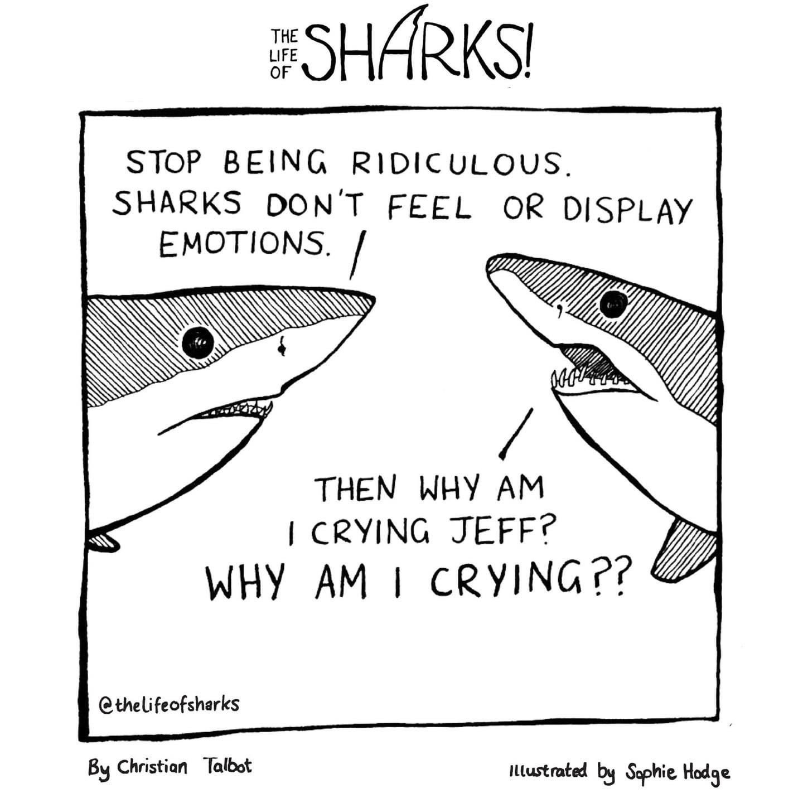

  <h3 align="center">Proving Steven Spielberg's Oscar winning movie wrong: an analysis on shark attacks around the world </h3>

  <h6 align="center">
    Ironhack: project I

## Table of contents

- [Introduction](#introduction)
- [Data Cleaning](#data-cleaning)
- [Who's more likely to be killed by a shark?](#exploratory-data-analysis)
    * [Year](#year)
    * [Age](#Age)
    * [Sex](#Sex)
    * [Country](#Country)
- [H1: Activity](#activity)
- [H2: Season](#contributing)
- [H1: Activity](#contributing)
- [Last remarks](#last-remarks)
- [Thanks](#thanks)

## Introduction

Jaws made it pretty clear that sharks are human-killing machines and we should be absolutely terrified of them. Is  that right? Are sharks as deadly as we think they are? Or we are having an irrational fear? Let's see what the data says.

For starters I think it's important to say that in the dataframe used for this analysis had 25 thousand rows, which means there have been more than 25 thousand reported attacks in the las centuries. That seems like a big number, until we compare it to converted into hours, amounts to 11,416 sharks killed worldwide every hour, that’s around 3 sharks per second, maybe sharks care more about the kind of food they eat than we do. 

## Data Cleaning

First I downloaded the dataframe and cleaned it. The data had more than 25 thousand rows and 24 columns, but around 79% of the data was missing. So I got rid of more than 20 thousand rows and more than 10 columns which didn't add anything to my analysis. I also extracted the month from the Date column, and got rid of the day, and changed the name of some columns, to make data manipulation easier later on.

## Exploratory Data Analysis 

Even though it is not probable to be attacked by a shark. Still, shark attacks do occur sometimes, so let's look into them. **Who is more prone to be attacked by a shark?** 

#### 1.1 Years

As we can see in the following graph, attacks have been increasing in the last 60 years, this may be due to the increase of ocean related activities in the last decades, (or maybe sharks have had technological improvements that help them be better at hunting?)

Still, even though there have been more attacks, the probablity of dying from one of these, has been lower each year. Even if there are more attacks nowadays, the number of fatal victims has stayed the same. 

#### 1.2 Age

By exploring the age of the victims, it's easy to see that the youth is more affected by shark attacks, probably due to the presence of this age range in the ocean, or maybe the elderly have more savings to bribe the ocean mafia. 

The people most affected are the one's from age 18-20. 

#### 1.3 Sex

Men are more probable to be attacked by a shark. 

#### 1.4 Countries

If you don't like thrilling, pulse-raising or breath-taking adventures, these are the places to avoid. If you are the opposite, these are the places to go. The 10 countries with most shark attacks are shown in the next table. 

## Hypothesis one: sharks are pretty nice towards divers  

There are about 30 million scuba dives around the world each week, that's 1.560 billion dives a year. On the other side, as we can see in the following graph, there have only been 194 shark attacks towards divers in the last 222 years. 

## Last Remarks

I read that the people that work at the Global Shark Attack File are trying to make data on shark attacks accessible to people so we can see the real threat that sharks have on humans and how to avoid this type of encounters. It's not their purpose to increase people's fear of sharks, they are trying to lessen the likelihood of these incidents via information, and they're trying to defend sharks in a way. So that's what I tried to do as well. This type of accidents happen, but they're not common, and there are things we can avoid to reduce them. 

## Thanks

Special thanks to The Life of Sharks for ilustrating my analysis, and for the work they do in shark conservation. 

Some Text

Enjoy :metal:
